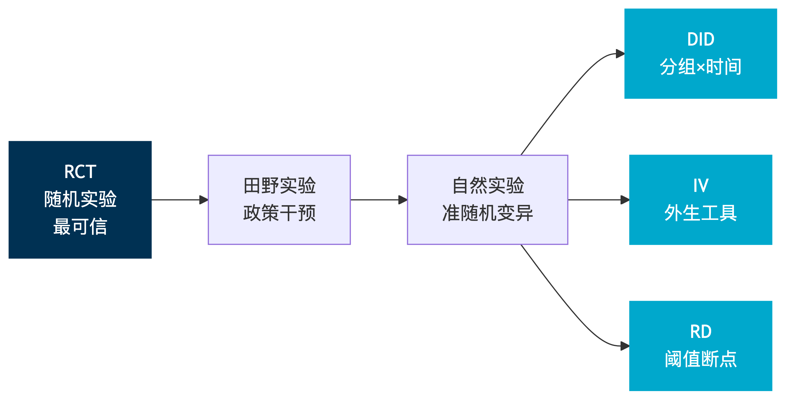
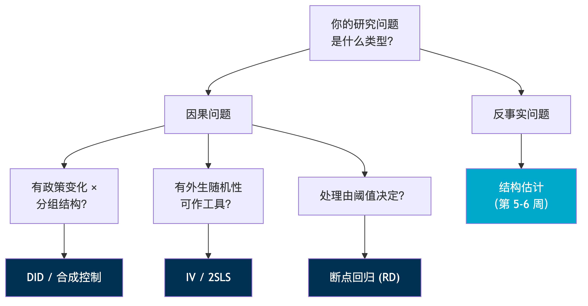
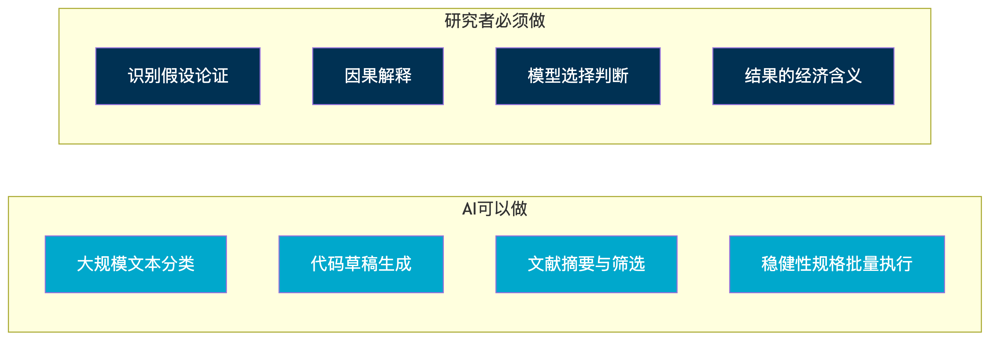

```{python}
#| echo: false
#| output: false
import numpy as np
import pandas as pd
import matplotlib.pyplot as plt
import matplotlib

plt.rcParams['font.sans-serif'] = ['Arial Unicode MS', 'SimHei', 'DejaVu Sans']
plt.rcParams['axes.unicode_minus'] = False
plt.rcParams['figure.dpi'] = 150

np.random.seed(42)
```

# 引言 {#sec-intro}

## 你研究能力的边界有多大？

2010 年代，一个典型的实证研究者面临严格的规模约束：手工阅读 200 篇文献需要数月，人工编码 1000 条文本需要数周，每次更改模型规格都要重新跑代码。2026 年，这些约束正在被 AI 工具系统性地打破——LLM 可以在一小时内筛选并归类 10,000 篇摘要，提示词标注可以处理百万条政策文本，AI 辅助的批量规格搜索可以在程序化检验下探索稳健性空间。

但“能做”不等于“应该做”，更不等于“做对了”。本课程的核心承诺不是“学一些 AI 工具”，而是理解 **AI 如何改变了哪些研究问题是可行的**——以及当 AI 介入时，研究者的判断在哪里不能缺席。

::: {.callout-warning}
## 虚假自信风险（False-Confidence Risk）

AI 工具扩大了研究的*规模*，但不能替代研究者的*判断*。常见陷阱包括：

- *幻觉引用*：GPT 自信给出从未存在的文献
- *无验证代码*：Copilot 写出“看起来对”却计算错误的统计量
- *自动化 p-hacking*：大规模规格搜索而不控制多重检验
- *测量漂移*：同一提示词在不同上下文产生不一致标注

本课程的回应是**信任但验证（Trust but Verify）**：每次使用 AI 工具，你都需要留下审计记录——使用了什么工具、做了什么任务、接受了什么、拒绝了什么、如何验证。
:::

## 课程的五个支柱

本课程围绕五个互补的方法论支柱展开，贯穿整个学期：

| 支柱 | 核心问题 | 周次 |
|:---|:---|:---|
| 减少形式因果推断 | 什么使识别策略可信？ | 第 1、3 周 |
| 因果机器学习 | ML 如何辅助识别，而非替代它？ | 第 4 周 |
| 结构估计 | 什么问题只能用结构模型回答？ | 第 5–6 周 |
| LLM 文本分析 | 如何用 AI 构建可靠的测量？ | 第 7 周 |
| AI 研究自动化 | 边界在哪里？治理规则是什么？ | 第 8 周 |

第一讲为全课程奠基：我们首先区分三类实证问题，建立潜在结果框架，理解选择偏差的来源与解决思路，然后概览四种核心识别工具，最后讨论 AI 如何改变实证研究的格局。

# 三类实证问题 {#sec-three-questions}

## 描述性、因果与反事实问题

实证研究的提问方式决定了回答所需的工具。理解这一分类是选择正确研究方法的前提。

**描述性问题（Descriptive）** 问的是“世界是什么样的”。例如：“中国企业 R&D 支出占销售额的比例有多高？”回答这类问题需要代表性样本和准确的测量，但不需要因果识别。

**因果问题（Causal）** 问的是“某一变量的变化导致了什么”。例如：“政府补贴是否提高了企业 R&D 支出？”回答这类问题的关键不在于计算，而在于*识别策略*——你必须论证为什么观测到的关联反映的是因果而非混淆。

**反事实问题（Counterfactual）** 问的是“如果政策不同，结果会怎样”。例如：“如果将补贴提高 50%，R&D 支出会增加多少？”这类问题超出了减少形式方法的能力范围，通常需要结构模型来刻画行为机制。

::: {.callout-note}
## 三类问题的工具匹配

| 问题类型 | 核心需求 | 主要方法 |
|:---|:---|:---|
| 描述性 | 代表性样本 + 准确测量 | 描述统计、指数构建、LLM 测量 |
| 因果 | 外生变异（识别策略） | DID、IV、RD、实验 |
| 反事实 | 结构模型（机制） | 需求估计、引力模型、DSGE |
:::

## 练习：区分问题类型

以下练习帮助你建立直觉——判断每个问题属于哪种类型：

1. “北京 PM2.5 浓度近十年如何变化？” → **描述性**（刻画趋势，不问因果）
2. “空气污染是否缩短了北京居民的预期寿命？” → **因果**（需要识别污染的外生变异）
3. “如果北京实施更严格的排放标准，死亡率会下降多少？” → **反事实**（需要结构模型模拟政策效果）
4. “哪些行业在降污方面表现最差？” → **描述性**（排序而非归因）
5. “企业面临碳税会减少多少排放量？” → **反事实**（需要估计企业减排的行为函数）

区分这三类问题的一个实用检验是：回答这个问题是否需要知道“如果处理不同，结果会怎样”？如果不需要，大概率是描述性问题；如果需要且处理已发生，是因果问题；如果需要且涉及未实施的政策，是反事实问题。

::: {.callout-warning}
## 最常见的混淆

把*相关性*当作*因果*，或把*局部处理效应*外推为*政策效果*。回归系数 $\hat{\beta}$ 从来不是自动的因果估计量——*识别策略*才是让 $\hat{\beta}$ 具有因果含义的东西。
:::

## AI 工具与问题类型的匹配

AI 工具在三类问题上的作用截然不同。在描述性研究中，AI 最为强大：LLM 标注、文本分类、非结构化数据测量——这些天然是大规模描述性任务，AI 可以显著提升效率和覆盖面。

然而，因果与反事实问题不能外包给 AI。无论 AI 生成多少代码，*识别假设*必须由研究者来论证。“平行趋势假设成立”不是 AI 能替你证明的——这是*研究设计*问题，不是*计算*问题。AI 可以帮你*实现*一个识别策略，但不能帮你*选择*或*论证*它。

# 因果推断的基本问题 {#sec-fundamental-problem}

## 为什么因果推断难？

考虑一个直觉的例子：健身房锻炼能减重吗？你比较了两组人——每周去健身房 3 次以上的人平均 BMI 为 23，从不去健身房的人平均 BMI 为 26。这个差异能说明健身有效吗？

答案是*不能*。去健身房的人在饮食习惯、健康动机、基础身体状况等方面本来就与不去的人不同。即使健身完全无效，这两组人的 BMI 也会有差异。这就是**选择偏差**（Selection Bias）——处理组和控制组在处理之前就不可比。

因果推断的核心困难在于：我们想知道的是“同一个人在两种状态下的差异”，但现实中每个人只能处于一种状态。这被称为因果推断的**基本问题**（Fundamental Problem of Causal Inference）。

## 潜在结果框架 {#sec-potential-outcomes}

Rubin 因果模型（Rubin Causal Model）为形式化因果推断提供了精确的数学语言。设个体 $i$ 的处理状态为 $D_i \in \{0, 1\}$，定义两个**潜在结果**（Potential Outcomes）：

- $Y_i(1)$：如果个体 $i$ 接受处理（$D_i = 1$），其结果
- $Y_i(0)$：如果个体 $i$ 未接受处理（$D_i = 0$），其结果

观测到的结果为：

$$Y_i = D_i \cdot Y_i(1) + (1 - D_i) \cdot Y_i(0)$$

对任意个体 $i$，我们只能观测到 $Y_i(1)$ 或 $Y_i(0)$ 中的一个，永远无法同时观测两者。因此，个体处理效应 $Y_i(1) - Y_i(0)$ 永远无法直接计算。

::: {.callout-note}
## 历史脉络：Neyman-Rubin 传统

潜在结果的思想可以追溯到 Neyman (1923) 在农业试验中的工作，后经 Rubin (1974) 系统化发展为现代因果推断框架。与结构方程模型（SEM）传统不同，潜在结果框架将“因果效应”定义为同一单位在两种处理状态下的结果差异，而非方程中的系数。这一框架的优势在于：它迫使研究者明确回答“与什么相比”这个核心问题。

Holland (1986) 在他的经典论文 “Statistics and Causal Inference” 中将这一困境简洁地概括为：“No causation without manipulation”——只有可以设想被操纵的变量，才能有意义地讨论其因果效应。
:::

## 平均处理效应与选择偏差 {#sec-ate}

由于无法观测个体处理效应，研究者转而关注**平均处理效应**（Average Treatment Effect, ATE）：

$$\tau = E[Y_i(1) - Y_i(0)]$$

一个自然的想法是用处理组和控制组的观测均值差来估计 ATE。但这里隐藏着选择偏差。以下推导展示了这一点。

**完整推导：**

观测到的均值差为：

$$\begin{aligned}
E[Y_i | D_i = 1] - E[Y_i | D_i = 0]
&= E[Y_i(1) | D_i = 1] - E[Y_i(0) | D_i = 0]
\end{aligned}$$

第一个等号利用了观测方程：当 $D_i = 1$ 时 $Y_i = Y_i(1)$，当 $D_i = 0$ 时 $Y_i = Y_i(0)$。

现在加入并减去 $E[Y_i(0) | D_i = 1]$：

$$\begin{aligned}
&= E[Y_i(1) | D_i = 1] - E[Y_i(0) | D_i = 1] + E[Y_i(0) | D_i = 1] - E[Y_i(0) | D_i = 0] \\
&= \underbrace{E[Y_i(1) - Y_i(0) | D_i = 1]}_{\text{ATT（处理组平均效应）}} + \underbrace{E[Y_i(0) | D_i = 1] - E[Y_i(0) | D_i = 0]}_{\text{选择偏差}}
\end{aligned}$$

**解读这个公式：**

- 第一项 ATT（Average Treatment Effect on the Treated）是处理组的平均处理效应——这正是我们想估计的。
- 第二项是选择偏差：它衡量的是，即使没有处理，处理组与控制组的结果是否本来就不同。

在健身房的例子中，$E[Y_i(0) | D_i = 1]$（去健身的人如果不去的 BMI）低于 $E[Y_i(0) | D_i = 0]$（不去健身的人的 BMI），因为健康意识高的人本来就更瘦。选择偏差为负，导致朴素比较高估了健身的效果。

## Python 模拟：选择偏差的直觉 {#sec-sim-selection-bias}

以下模拟清晰展示了选择偏差如何扭曲朴素比较。我们构造一个数据生成过程（DGP），其中“健康意识”既影响是否去健身（处理变量），又影响 BMI（结果变量）。

```{python}
#| code-fold: show
#| code-summary: "点击查看完整代码"

np.random.seed(42)
n = 2000

# 数据生成过程
health_motive = np.random.normal(0, 1, n)  # 健康意识（混淆变量）

# 处理分配：健康意识越高，越可能去健身
gym = (health_motive + np.random.normal(0, 0.5, n)) > 0.5

# 潜在结果
y0 = 25 - 2 * health_motive + np.random.normal(0, 1, n)  # BMI（不去健身）
y1 = y0 - 1.0  # 真实处理效应：健身减少 1 个 BMI 单位

# 观测结果
y_obs = np.where(gym, y1, y0)

# 朴素比较
naive_diff = y_obs[gym].mean() - y_obs[~gym].mean()
true_ate = (y1 - y0).mean()

print(f"真实 ATE = {true_ate:.2f}")
print(f"朴素均值差 = {naive_diff:.2f}")
print(f"选择偏差 ≈ {naive_diff - true_ate:.2f}")
```

朴素比较大幅高估了效应。下图进一步展示了处理组和控制组在“不去健身时的 BMI”上的分布差异——这正是选择偏差的来源。

```{python}
#| echo: false
#| fig-cap: "选择偏差的直觉：处理组和控制组的潜在结果 Y(0) 分布不同"
#| fig-width: 12
#| fig-height: 5

fig, axes = plt.subplots(1, 2, figsize=(12, 5))

# 左图：Y(0) 的分布比较
axes[0].hist(y0[gym], bins=30, alpha=0.6, color='#003153', label='去健身的人的 Y(0)', density=True)
axes[0].hist(y0[~gym], bins=30, alpha=0.6, color='#00A8CC', label='不去健身的人的 Y(0)', density=True)
axes[0].axvline(y0[gym].mean(), color='#003153', linestyle='--', linewidth=2)
axes[0].axvline(y0[~gym].mean(), color='#00A8CC', linestyle='--', linewidth=2)
axes[0].set_xlabel('BMI (不去健身的潜在结果)', fontsize=12)
axes[0].set_ylabel('密度', fontsize=12)
axes[0].set_title('选择偏差的来源：Y(0) 分布不同', fontsize=13)
axes[0].legend(fontsize=10)

# 右图：观测结果 vs 真实效应
group_means = pd.DataFrame({
    '组别': ['去健身 (观测)', '不去健身 (观测)', '真实 ATE'],
    '均值': [y_obs[gym].mean(), y_obs[~gym].mean(), true_ate],
    '类型': ['观测', '观测', '真实']
})
colors = ['#003153', '#00A8CC', '#e74c3c']
bars = axes[1].bar(group_means['组别'], group_means['均值'], color=colors, alpha=0.8)
axes[1].set_ylabel('BMI / 效应值', fontsize=12)
axes[1].set_title('朴素比较 vs 真实效应', fontsize=13)
for bar, val in zip(bars, group_means['均值']):
    axes[1].text(bar.get_x() + bar.get_width()/2, bar.get_height() + 0.1,
                f'{val:.2f}', ha='center', fontsize=11)

plt.tight_layout()
plt.show()
```

## 随机化如何消除选择偏差 {#sec-randomization}

随机实验（RCT）之所以被视为因果推断的“金标准”，正是因为它从根源上消除了选择偏差。

**严格证明：** 若 $D_i$ 随机分配（即 $D_i \perp (Y_i(1), Y_i(0))$），则：

$$E[Y_i(0) | D_i = 1] = E[Y_i(0) | D_i = 0] = E[Y_i(0)]$$

将此代入选择偏差公式：

$$\text{选择偏差} = E[Y_i(0) | D_i = 1] - E[Y_i(0) | D_i = 0] = 0$$

因此观测均值差恰好等于 ATE。直觉是：随机化确保了处理组和控制组在*所有*特征上（包括不可观测的）是统计等价的，从而使两组在“如果不处理”时的结果分布相同。

### Python 模拟：随机化的效果

```{python}
#| code-fold: show
#| code-summary: "点击查看 RCT 模拟代码"
#| fig-cap: "随机化消除选择偏差：1000 次模拟的估计量分布"
#| fig-width: 12
#| fig-height: 5

np.random.seed(42)
n_sim = 1000
n = 500
naive_ests = []
rct_ests = []

for _ in range(n_sim):
    health = np.random.normal(0, 1, n)
    y0 = 25 - 2 * health + np.random.normal(0, 1, n)
    y1 = y0 - 1.0  # 真实 ATE = -1

    # 朴素观测（健康的人自选去健身）
    gym_obs = (health + np.random.normal(0, 0.5, n)) > 0.5
    y_obs = np.where(gym_obs, y1, y0)
    naive_ests.append(y_obs[gym_obs].mean() - y_obs[~gym_obs].mean())

    # 随机实验
    gym_rct = np.random.binomial(1, 0.5, n).astype(bool)
    y_rct = np.where(gym_rct, y1, y0)
    rct_ests.append(y_rct[gym_rct].mean() - y_rct[~gym_rct].mean())

fig, ax = plt.subplots(figsize=(12, 5))
ax.hist(naive_ests, bins=40, alpha=0.6, color='#e74c3c', label=f'朴素比较 (均值={np.mean(naive_ests):.2f})', density=True)
ax.hist(rct_ests, bins=40, alpha=0.6, color='#003153', label=f'RCT 估计 (均值={np.mean(rct_ests):.2f})', density=True)
ax.axvline(-1.0, color='black', linestyle='--', linewidth=2, label='真实 ATE = -1.0')
ax.set_xlabel('估计的处理效应', fontsize=12)
ax.set_ylabel('密度', fontsize=12)
ax.set_title('1000 次模拟：朴素比较 vs 随机实验', fontsize=13)
ax.legend(fontsize=11)
plt.tight_layout()
plt.show()
```

模拟结果清楚地显示：朴素比较的分布中心偏离真实 ATE（因为选择偏差），而 RCT 估计量的分布精确地以真实 ATE 为中心。

## 识别的核心逻辑 {#sec-identification}

当随机实验不可行时（大多数经济学研究场景），研究者需要一个**识别策略**（Identification Strategy）——用数据和制度背景论证“在我们的设定下，选择偏差为零或可忽略”。

::: {.callout-tip}
## 如何评估一个识别策略

每一个可信的因果研究，都必须明确回答：*为什么选择偏差在这里为零或可忽略？* 这不是一个统计检验能回答的问题——它需要对制度细节、数据来源和行为假设的深入论证。
:::

本课程覆盖四种核心识别工具：

| 工具 | 核心假设 | 典型场景 |
|:---|:---|:---|
| RCT | 随机化 | 田野实验、医药试验 |
| DID | 平行趋势 | 政策分组 × 时间 |
| IV/2SLS | 排他性限制 | 工具变量研究 |
| RD | 连续性假设 | 阈值规则 |

# 研究设计工具箱 {#sec-toolkit}

## 从 RCT 到自然实验的谱系

{#fig-rct-spectrum}

这张图展示了实证研究中不同识别策略的谱系。越向右，*识别假设*越强、越需要论证，但*研究问题*的范围越广。随机实验（RCT）的识别假设最弱（只需随机化），但适用场景最窄。到自然实验和准实验方法（DID、IV、RD），研究者可以回答更广泛的政策问题，但必须付出更多的论证成本。

## 双重差分法（DID）预览 {#sec-did-preview}

双重差分法（Difference-in-Differences, DiD）是应用微观经济学中使用最广泛的因果识别策略之一。其核心思想是：不比较处理组和控制组的*水平值*（会有选择偏差），而比较两组的*变化量*。

$$\hat{\tau}_{DID} = \underbrace{(\bar{Y}_{T,\text{post}} - \bar{Y}_{T,\text{pre}})}_{\text{处理组变化}} - \underbrace{(\bar{Y}_{C,\text{post}} - \bar{Y}_{C,\text{pre}})}_{\text{控制组变化}}$$

**直觉推导：** 假设处理组和控制组在处理前的结果水平可能不同（存在基线差异），但它们的*变化趋势*相同。那么控制组的变化量就是处理组“如果没有被处理”的变化量。用处理组的实际变化减去这个反事实变化，差值就是处理效应。

**核心假设——平行趋势（Parallel Trends）：** 若无处理，处理组与控制组的结果变化趋势相同：

$$E[Y_{it}(0) | D_i = 1, t = 1] - E[Y_{it}(0) | D_i = 1, t = 0] = E[Y_{it}(0) | D_i = 0, t = 1] - E[Y_{it}(0) | D_i = 0, t = 0]$$

::: {.callout-note}
## Card & Krueger (1994)：自然实验的经典

1992 年，新泽西州将最低工资从 \$4.25 提高到 \$5.05，而邻近的宾夕法尼亚州保持不变。Card 和 Krueger 利用这一政策差异，以宾州快餐店为控制组，比较了两州快餐业就业的变化量。

**数据**：对新泽西和宾州东部 410 家快餐店进行了电话调查（政策实施前后各一次）。

**结果**：加薪后新泽西快餐店就业不降反升，挑战了标准供需模型的预测。

**后续争议**：Neumark & Wascher (1995) 使用不同数据来源（薪资记录而非电话调查）得出相反结论。这一争论表明，即使识别策略相同，*数据质量*和*测量方式*也至关重要。

**第 3 周将深入讲解**：交错处理时序下 TWFE 的缺陷、Callaway-Sant'Anna 估计量、事件研究图与预趋势检验。
:::

## 工具变量法（IV）预览 {#sec-iv-preview}

当处理变量 $D_i$ 是内生的——即与误差项 $\varepsilon_i$ 相关——时，OLS 有偏。工具变量法的思想是：寻找一个“代理随机性”来源。

**工具变量（Instrumental Variable, IV）** 是一个变量 $Z_i$，满足两个条件：

- *相关性*（Relevance）：$Z_i$ 与 $D_i$ 高度相关
- *排他性*（Exclusion Restriction）：$Z_i$ 只通过 $D_i$ 影响 $Y_i$，不直接影响

::: {.callout-note}
## Angrist (1990)：越战服役抽签

越战期间，美国通过抽签号码决定服役优先序。Angrist 利用这个随机抽签作为工具变量，识别服兵役对退伍后收入的因果效应。

**为什么有效**：抽签号码是随机分配的（满足排他性和相关性前提），与个人特征无关。低号码的人更可能被征召入伍，但号码本身不会直接影响收入。

**注意**：IV 估计的是*局部平均处理效应*（LATE）——只对那些因工具变量而改变处理状态的“服从者”（Compliers）有效，而非全部人群的 ATE。
:::

## 断点回归法（RD）预览 {#sec-rd-preview}

断点回归法（Regression Discontinuity）利用的是政策规则中的阈值：在阈值两侧，个体“几乎一样”，但处理状态发生突变。这个突变处的结果跳跃即为处理效应。

::: {.callout-note}
## Angrist & Lavy (1999)：Maimonides 规则

以色列教育法规规定：一个年级的学生人数超过 40 人时必须分班（即开设第二个班）。这意味着 39 人的班级 vs 41 人的两个小班——学生几乎一样，但班级规模突变。

**研究设计**：在学生人数恰好围绕 40 人阈值的学校中，Angrist 和 Lavy 利用班级规模的突变来识别班级规模对学生成绩的因果效应。

**核心假设——连续性**：潜在结果在阈值处连续变化（没有学校通过操纵学生人数来“选择”分班或不分班）。
:::

## 识别策略地图

{#fig-id-map}

这张地图展示了四种识别策略的逻辑关系：从随机化到准随机，从水平比较到趋势比较。理解这张地图将帮助你在面对具体研究问题时选择合适的工具。

### Python 模拟：三类问题的统一数据生成 {#sec-sim-three-questions}

以下模拟用同一个数据生成过程（DGP），展示对“补贴与 R&D”这个主题，描述性、因果和反事实问题的回答如何不同。

```{python}
#| code-fold: show
#| code-summary: "点击查看三类问题的模拟代码"
#| fig-cap: "同一 DGP 下的三类实证问题：描述性（左）、因果（中）、反事实（右）"
#| fig-width: 14
#| fig-height: 5

np.random.seed(42)
n = 1000

# DGP：企业规模影响是否获得补贴和 R&D 支出
firm_size = np.random.lognormal(2, 0.8, n)  # 企业规模（混淆变量）
subsidy = (0.3 * np.log(firm_size) + np.random.normal(0, 1, n)) > 1.5  # 大企业更可能获补贴
rd_no_sub = 2 + 0.5 * np.log(firm_size) + np.random.normal(0, 0.5, n)  # Y(0)
true_effect = 1.5  # 补贴的真实因果效应
rd_with_sub = rd_no_sub + true_effect  # Y(1)
rd_obs = np.where(subsidy, rd_with_sub, rd_no_sub)

fig, axes = plt.subplots(1, 3, figsize=(14, 5))

# 描述性问题：R&D 支出分布
axes[0].hist(rd_obs, bins=30, color='#003153', alpha=0.7, edgecolor='white')
axes[0].set_title('描述性：R&D 支出分布如何？', fontsize=12)
axes[0].set_xlabel('R&D 支出 (%销售额)', fontsize=11)
axes[0].set_ylabel('频数', fontsize=11)
axes[0].axvline(rd_obs.mean(), color='#e74c3c', linestyle='--', linewidth=2,
               label=f'均值 = {rd_obs.mean():.2f}')
axes[0].legend(fontsize=10)

# 因果问题：补贴 → R&D?
axes[1].bar(['有补贴', '无补贴'], [rd_obs[subsidy].mean(), rd_obs[~subsidy].mean()],
           color=['#003153', '#00A8CC'], alpha=0.8)
naive_est = rd_obs[subsidy].mean() - rd_obs[~subsidy].mean()
axes[1].set_title(f'因果：朴素差 = {naive_est:.2f}（真实 = {true_effect:.1f}）', fontsize=12)
axes[1].set_ylabel('平均 R&D 支出', fontsize=11)

# 反事实问题：提高补贴 50%
counterfactual_effect = true_effect * 1.5  # 简化的结构假设
axes[2].bar(['当前补贴', '提高 50%'],
           [rd_with_sub[subsidy].mean(),
            rd_with_sub[subsidy].mean() + (counterfactual_effect - true_effect)],
           color=['#003153', '#e74c3c'], alpha=0.8)
axes[2].set_title('反事实：提高 50% 补贴后？', fontsize=12)
axes[2].set_ylabel('预期 R&D 支出', fontsize=11)

plt.tight_layout()
plt.show()
```

注意中间面板：朴素均值差高估了因果效应，因为大企业既更可能获得补贴又有更高的 R&D 支出（选择偏差）。而右侧面板的反事实分析需要结构假设——减少形式方法无法回答“如果提高 50% 补贴”这类问题。

# AI 时代的实证研究格局 {#sec-ai-era}

## AI 扩展了研究的可行边界

AI 工具正在系统性地扩展实证研究的可行边界。以前受制于数据规模和人力成本的研究问题，现在可以做了。

::: {.callout-tip}
## Fang, Li & Lu (2025)：解码中国产业政策

Fang, Li 和 Lu 使用大语言模型从数百万份政府文件中提取结构化政策信息，构建了覆盖 1990–2020 年的细粒度产业政策数据库。这在人工编码时代根本不可行——仅数据标注环节就需要上千人年的工作量。

**关键创新**：他们不是简单地让 LLM 标注文本，而是设计了一个包含验证样本、交叉检验和误差分析的完整流程。这正是课程第 7 周要深入讨论的方法论。
:::

::: {.callout-tip}
## Ludwig, Mullainathan & Rambachan (2025)：LLM 作为计量经济学工具

Ludwig 等人提出了一个将 LLM 作为计量经济学工具的统一框架。他们的核心区分是：LLM 可以用于*预测*（标注、分类、信息提取），但不能替代*估计*（因果推断、结构参数识别）。当 LLM 输出被用于下游回归时，测量误差可能导致偏差——他们提供了误差修正的方法论。
:::

## 文献综述自动化

传统的文献综述流程（搜索 → 阅读摘要 → 人工筛选 → 全文阅读）正在被 AI 增强。现代流程包括：

1. **语义搜索**批量筛选相关文献（比关键词搜索更精准）
2. **LLM 提取**每篇论文的研究问题、方法和结论
3. **研究者审阅** LLM 摘要，决定哪些值得精读
4. 使用 Zotero + Claude Code 等工具管理引用数据库

::: {.callout-warning}
## 幻觉引用风险

LLM 可以自信地生成*从未存在*的论文标题和作者。在多次测试中，GPT-4 生成的引用中有 10%–30% 是完全虚构的。*每一条引用必须在原始数据库（Google Scholar、Semantic Scholar、SSRN 等）中验证*——这是不可外包的步骤。
:::

## AI 辅助编码与复现

Copilot 辅助编码的典型工作流为：

1. 研究者用自然语言描述需求
2. Copilot 生成 Stata/Python 代码草稿
3. 研究者*阅读并理解*每一行代码
4. 运行 → 查看结果 → 验证是否合理
5. 写简短审计备注：接受了什么、改了什么、为什么

判断代码是否正确的责任永远在研究者身上。“AI 写的代码，所以我不确定对不对”——这不是学术免责声明。

## LLM 作为实证测量工具

当 LLM 被用于构建实证变量（例如，用提示词标注政策文本的类型），一个核心问题随之而来：LLM 标注的文本变量，能用于下游因果分析吗？

这涉及三层效度问题：

- **构念效度**（Construct Validity）：提示词真的测量了你想测的概念吗？
- **标注可靠性**（Reliability）：不同提示、不同时间、不同模型版本，标注稳定吗？
- **下游推断偏差**：用 LLM 测量值做回归，估计量有偏吗？

Ludwig et al. (2025) 的结论是：LLM 测量值 + 人工验证样本 + 误差修正，可以产生有效的下游推断——但必须*设计*这个验证流程，而非假设 LLM 输出就是“真值”。

## 信任但验证：本课程的 AI 使用原则

::: {.callout-note}
## AI 使用审计日志模板

每次提交中，AI 使用的记录必须包含：

- *工具*：Copilot / Claude / Cursor / DeepSeek / ...
- *任务*：代码生成 / 文献筛选 / 文本标注 / ...
- *接受的输出*：具体说明接受了什么（附例子）
- *拒绝或修改的输出*：附修改说明
- *验证方式*：如何确认最终结果是正确的

这不是额外负担——这是现代研究的可重复性标准。
:::

## AI 的边界在哪里？

{#fig-ai-boundary}

上图总结了 AI 在实证研究各环节中的角色。AI 擅长的领域（数据处理、代码草拟、文献筛选）与研究者不可替代的领域（识别策略论证、因果逻辑判断、结果解释）之间有清晰的边界。本课程的目标是帮助学生在这条边界上找到最佳的人机协作点。

# 总结 {#sec-summary}

## 本讲要点回顾

### AI 改变了可行研究的边界

AI 工具在文献综述、测量构建、代码生成等方面显著扩大了研究规模，但因果推断的核心逻辑——识别策略的选择与论证——不能外包。

### 三类实证问题需要不同工具

描述性问题需要代表性和测量精度，因果问题需要外生变异来源（识别策略），反事实问题需要结构模型来刻画机制。混淆这三类问题是实证研究中最常见的错误之一。

### 因果推断的核心障碍是选择偏差

潜在结果框架给出了精确的数学描述：我们只能观测 $Y_i(1)$ 或 $Y_i(0)$ 中的一个。朴素均值差 = ATT + 选择偏差，除非有额外论证，选择偏差不为零。

### 四种识别策略的逻辑

- **RCT**：随机化消除选择偏差
- **DID**：差消基线差异，假设平行趋势
- **IV**：用外生变量作为处理的“代理随机性”
- **RD**：阈值两侧近似随机分配

### 信任但验证是 AI 使用的核心原则

每次使用留下审计日志。引用验证、代码阅读、结果检查——这些不可外包。虚假自信风险比不用 AI 更危险。

## 关键公式汇总

| 概念 | 公式 | 说明 |
|:---|:---|:---|
| 观测方程 | $Y_i = D_i Y_i(1) + (1-D_i) Y_i(0)$ | 只能观测一个潜在结果 |
| ATE | $\tau = E[Y(1) - Y(0)]$ | 平均处理效应 |
| 均值差分解 | $E[Y\|D=1] - E[Y\|D=0]$ $= \text{ATT} + \text{选择偏差}$ | 朴素比较的偏差来源 |
| 随机化 | $D \perp (Y(1), Y(0)) \Rightarrow \text{选择偏差} = 0$ | 随机化消除选择偏差 |
| DID | $\hat{\tau} = (\bar{Y}_{T,\text{post}} - \bar{Y}_{T,\text{pre}}) - (\bar{Y}_{C,\text{post}} - \bar{Y}_{C,\text{pre}})$ | 差消基线差异 |

## 下一讲预告

**第 2 周：计算基础与 AI 辅助可重复工作流**

下一讲将从方法论转向实践——建立你的研究基础设施。内容包括 VS Code + Python + Stata/R 环境搭建、Jupyter notebook 的结构化使用习惯、Monte Carlo 模拟方法，以及“信任但验证”工作流的第一次实践。在第 3–8 周做任何实证分析之前，先建立代码环境和验证习惯——这是可重复研究的基础设施。

## 课后思考

1. **在你的研究领域**，找一个常被误认为“因果”的相关性描述。它的选择偏差可能来源于什么？你能设计一个识别策略来解决吗？

2. **关于 AI 使用边界**：假设你用 LLM 标注了 10,000 篇论文的研究方法类别，并发现使用 DID 的论文在 2015 年后大幅增加。这个发现是描述性的、因果性的，还是反事实的？如果你想进一步问“是什么驱动了 DID 的流行”，你的问题类型发生了什么变化？

3. **选择偏差的日常直觉**：经常看书的人收入更高。设计一个思想实验，说明为什么朴素比较会高估“读书对收入的因果效应”，并讨论什么样的工具变量可能有效。

# 参考文献 {#sec-references}

- Abadie, A., & Cattaneo, M. D. (2018). Econometric methods for program evaluation. *Annual Review of Economics*, 10, 465–503.
- Angrist, J. D. (1990). Lifetime earnings and the Vietnam era draft lottery: Evidence from social security administrative records. *American Economic Review*, 80(3), 313–336.
- Angrist, J. D., & Lavy, V. (1999). Using Maimonides' rule to estimate the effect of class size on scholastic achievement. *Quarterly Journal of Economics*, 114(2), 533–575.
- Card, D., & Krueger, A. B. (1994). Minimum wages and employment: A case study of the fast-food industry in New Jersey and Pennsylvania. *American Economic Review*, 84(4), 772–793.
- Chernozhukov, V., et al. (2024). *Applied causal inference powered by ML and AI*. arXiv: 2403.02467.
- Fang, H., Li, Z., & Lu, Y. (2025). *Decoding China's industrial policies*. NBER Working Paper 33814.
- Holland, P. W. (1986). Statistics and causal inference. *Journal of the American Statistical Association*, 81(396), 945–960.
- Ludwig, J., Mullainathan, S., & Rambachan, A. (2025). *Large language models: An applied econometric framework*. NBER Working Paper 33344.
- Neumark, D., & Wascher, W. (1995). The effect of New Jersey's minimum wage increase on fast-food employment: A re-evaluation using payroll records. NBER Working Paper 5224.
- Neyman, J. (1923). On the application of probability theory to agricultural experiments. *Statistical Science*, 5(4), 465–472. [Translated and reprinted 1990]
- Rubin, D. B. (1974). Estimating causal effects of treatments in randomized and nonrandomized studies. *Journal of Educational Psychology*, 66(5), 688–701.

---

**联系方式**

- 邮箱：chenzhiyuan@rmbs.ruc.edu.cn
- 办公室：人民大学主校区（通州），商学楼316
- Office Hours：邮件或微信预约

*本讲义基于 Abadie & Cattaneo (2018)、Angrist & Pischke (2009)、Rubin (1974) 以及 Ludwig et al. (2025) 等文献整理而成。
