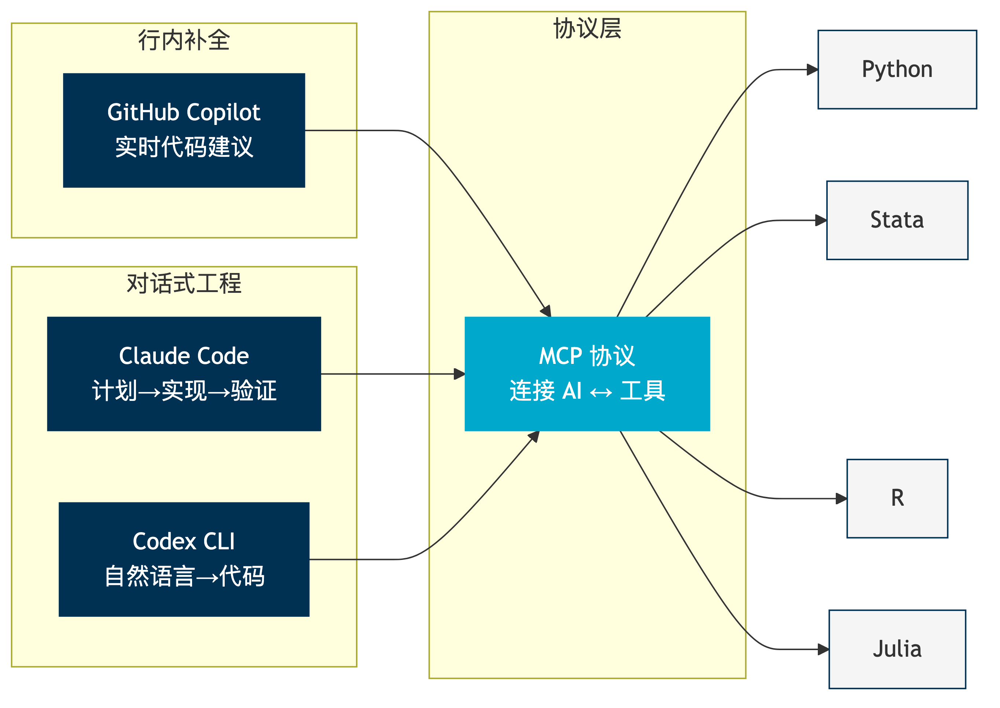
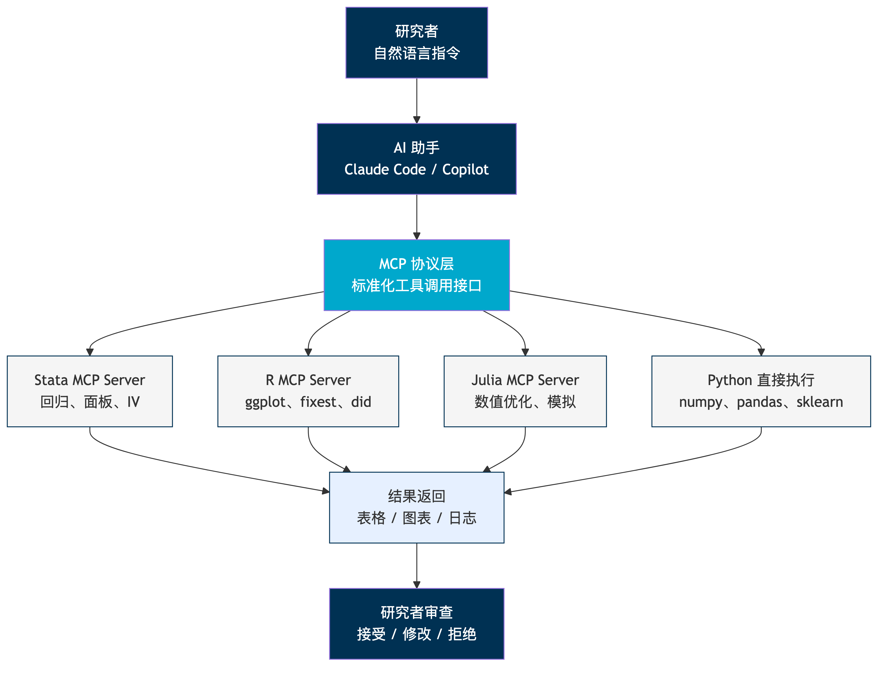
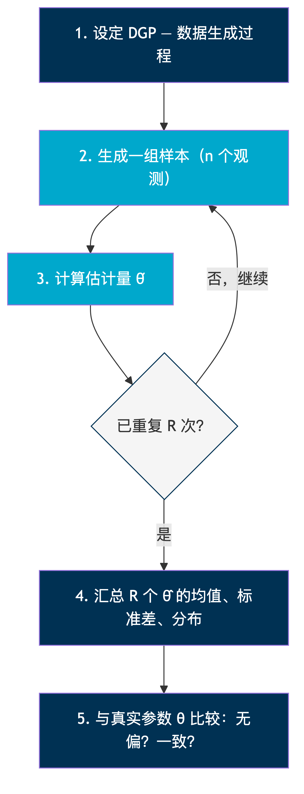

```{python}
#| echo: false
#| output: false
import numpy as np
import pandas as pd
import matplotlib.pyplot as plt
import matplotlib
import warnings
warnings.filterwarnings('ignore')

plt.rcParams['font.sans-serif'] = ['Arial Unicode MS', 'SimHei', 'DejaVu Sans']
plt.rcParams['axes.unicode_minus'] = False
plt.rcParams['figure.dpi'] = 150

np.random.seed(42)
```

## 上节课回顾

::: {.concept-box}
**第 1 周核心内容**

- *三类实证问题*：描述性、因果、反事实——需要不同工具
- *潜在结果框架*：$Y_i(1), Y_i(0)$ 只能观测一个
- *识别策略*：DID、IV、RD、RCT——核心在于论证选择偏差为零
- *信任但验证*：AI 扩大规模，但判断不能外包
:::

. . .

*本节课的问题*

在你开始做任何实证分析之前——你的**计算环境**准备好了吗？

---

## 你的研究环境能支撑多大的野心？

. . .

::: {.warning-box}
**现实场景**

- 在 Stata 里跑回归，在 Excel 里画图，在 Word 里写报告——每一步都断裂
- 代码没有版本控制，改了三版后忘了哪版是对的
- 换了一台电脑，代码跑不了——路径硬编码、包版本不对
- AI 帮你写了 50 行代码，你不确定哪一行对、哪一行错
:::

. . .

::: {.concept-box}
**本节课目标**

四个模块：*计算环境搭建* → *AI 工具集成* → *Monte Carlo 直觉* → *工作流全过程*
:::

---

# 一、计算环境搭建 {background-color="#003153"}

---

## VS Code：统一研究平台

::: {.concept-box}
**为什么不各自为政？**

RStudio 只能写 R，Stata GUI 只能写 Stata，MATLAB IDE 只能写 MATLAB——
当你的研究需要*多种语言协作*时，你需要一个*统一平台*。
:::

. . .

*VS Code 的优势*

- 一个编辑器支持 Python、R、Stata、Julia、LaTeX、Markdown
- 集成终端——不用切换窗口
- 内置 Git——版本控制就在手边
- 扩展生态——Copilot、Jupyter、Quarto 全部可用
- 免费、跨平台、社区活跃

---

## Python + Jupyter Notebook

::: {.concept-box}
**Jupyter Notebook 的结构化使用**

不是“随便写写代码”——而是*可执行的研究文档*。

- *Markdown cell*：记录研究思路、假设、解读
- *Code cell*：执行分析、生成图表
- *Output*：结果与代码紧密绑定
:::

. . .

**最佳实践**

| 习惯 | 原因 |
|:---|:---|
| *每个 cell 只做一件事* | 方便调试和重复运行 |
| *Markdown 记录“为什么”* | 代码说“做了什么”，文字说“为什么这么做” |
| *开头设置种子和路径* | 确保可重复 |
| *结尾清理临时变量* | 保持环境干净 |

---

## Stata 在 Python/Jupyter 中的调用

::: {.example-box}
**stata_setup：在 Jupyter 中直接运行 Stata**

Python 是“胶水语言”——它可以调用 Stata 做你最擅长的事。
:::

. . .

::: {style="font-size: 1em;"}
```{python}
#| echo: true
#| eval: false

# 第一步：安装
# pip install stata_setup

# 第二步：配置（根据你的 Stata 安装路径）
import stata_setup
stata_setup.config("/Applications/Stata", "mp")

# 第三步：在 cell 中直接写 Stata 代码
# %%stata
# sysuse auto, clear
# reg mpg weight, robust
```
:::

. . .

*关键*：Stata 做回归，Python 做数据处理和可视化——各用所长。

---

## R 在 VS Code 中的集成

::: {.concept-box}
**R 开发者也不需要离开 VS Code**

- *R Extension*：语法高亮、代码补全、函数帮助
- *radian*：比默认 R 终端更好用的交互式终端
- *.qmd 中的 R 代码块*：`{r}` 直接执行
:::

. . .

::: {style="font-size: 1em;"}
```{python}
#| echo: true
#| eval: false

# 在 Quarto 文档中使用 R（示意）：
# ```{r}
# library(fixest)
# model <- feols(y ~ d | id + year, data = panel)
# etable(model)
# ```
```
:::

. . .

*推荐包*：`fixest`（面板回归）、`did`（Callaway-Sant'Anna）、`ggplot2`（可视化）

---

## Julia + Jupyter Notebook

::: {.example-box}
**Julia：当你需要速度的时候**

Julia 结合了 Python 的易用性和 C 的速度。
结构估计、数值优化、大规模模拟——Julia 是理想选择。
:::

. . .

**VS Code 中的 Julia 工作流**

| 步骤 | 操作 |
|:---|:---|
| *安装* | [julialang.org](https://julialang.org) 下载，添加到 PATH |
| *VS Code 扩展* | 安装 Julia 扩展（语法、REPL、调试） |
| *Jupyter 内核* | `using Pkg; Pkg.add("IJulia")` 安装 IJulia |
| *运行* | 在 Jupyter notebook 中选择 Julia 内核 |

. . .

*典型场景*：BLP 需求估计的内层收缩映射——Python 太慢，Julia 快 10-100 倍。

---

## 多语言协作的逻辑

::: {.concept-box}
**每种语言各司其职**

不是要学会所有语言——而是知道*什么时候用什么*。
:::

. . .

| 语言 | 擅长场景 | 本课程中的角色 |
|:---|:---|:---|
| *Python* | 开源：数据处理、ML、LLM 调用、胶水 | 主力语言 |
| *Stata* | 闭源：面板回归、DID、IV、聚类标准误 | 因果推断主力 |
| *R* | 开源：可视化、统计建模、前沿包 | 补充与对照 |
| *Julia* | 开源：数值优化、大规模模拟 | 结构估计加速 |
| *Matlab* | 闭源：矩阵运算、数值分析 | 结构估计传统选择 |

. . .

*环境管理要点*：`venv`/`conda` 管理 Python 环境，种子固定（`np.random.seed(42)`），路径用相对路径。

---

## 环境管理：可重复性的基础设施

::: {.warning-box}
**“在我电脑上能跑”不是可重复性**

换一台机器、换一个包版本、换一个操作系统——你的代码还能跑吗？
:::

. . .

| 问题 | 解决方案 |
|:---|:---|
| *Python 包版本冲突* | `venv` 或 `conda` 创建隔离环境 |
| *路径在不同机器上不同* | 用相对路径，不用绝对路径 |
| *随机结果不可重复* | 在脚本开头固定种子 |
| *忘记安装了哪些包* | `pip freeze > requirements.txt` |
| *Stata ado 版本不一致* | 记录 `ssc install` 的包名和日期 |

. . .

*底线*：你的合作者（包括三个月甚至若干年后的你自己）应该能*一键*重现所有结果。

---

## 实操演示：从零搭建研究环境

::: {.concept-box}
**五步完成环境搭建**

1. 安装 VS Code + Python/R/Stata/Julia 扩展
2. 创建虚拟环境：`python -m venv .venv`
3. 安装核心包：`pip install numpy pandas matplotlib jupyter`
4. 配置 Jupyter 内核：`python -m ipykernel install --user`
5. 测试：新建 notebook，运行 `import numpy; print(numpy.__version__)`
:::

. . .

::: {.example-box}
**Julia 环境搭建**

```julia
# 在 Julia REPL 中
using Pkg
Pkg.add("IJulia")      # Jupyter 内核
Pkg.add("Optim")       # 数值优化
Pkg.add("DataFrames")  # 数据框
```

安装完成后，在 Jupyter 中选择“Julia”内核即可使用。
:::


# 二、AI 编程工具集成 {background-color="#003153"}

---

## AI 编程工具的谱系
:::{.intro-mermaid}
{fig-align="center"}
:::
. . .

三类工具，三种交互模式——但都通过 *MCP 协议*连接到你的研究工具链。

---

## GitHub Copilot：行内智能补全

::: {.concept-box}
**Copilot 做什么**

在你*写代码的过程中*，实时建议下一行或下一段。
不需要切换窗口——它就在你的编辑器里。
:::

. . .

**实际场景**

- 你写 `reg y d x,`——Copilot 建议 `robust cluster(id)`
- 你写 `# 画事件研究图`——Copilot 生成 `coefplot` 代码
- 你写 `pd.read_csv(`——Copilot 建议路径和参数

. . .

::: {.warning-box}
**Copilot 的局限**

- 补全基于模式匹配，*不理解你的研究设计*
- 可能建议看起来对但统计上错误的代码
- *每一行都需要人工审查*——不能盲目接受
:::

---

## Claude Code：对话式研究工程

::: {.concept-box}
**Claude Code 做什么**

不是补全单行代码——而是*理解你的研究目标*，
帮你规划、实现、验证整个工作流。
:::

. . .

**工作模式：Plan → Implement → Verify**

1. *Plan*：你描述研究目标，Claude Code 制定实现方案
2. *Implement*：自主编写代码、创建文件、组织项目
3. *Verify*：运行代码、检查结果、修复问题

. . .

::: {.example-box}
**典型对话**

“帮我用 Callaway-Sant'Anna 方法估计交错 DID，数据在 `data/panel.csv`，
处理变量是 `policy`，结果变量是 `y`，要画事件研究图。”

Claude Code 不仅写代码——它会组织项目结构、处理数据清洗、生成图表、写文档。
:::

---

## Codex CLI：自然语言→批量代码

::: {.concept-box}
**OpenAI Codex CLI 做什么**

在终端中用自然语言描述任务，直接生成并执行代码。
适合*批量处理*和*自动化脚本*。
:::

. . .

**典型用法**

- “读取 data/ 下所有 CSV 文件，合并成面板，保存到 output/”
- “对 results/ 下所有回归表格生成 LaTeX 格式”
- “批量检查 code/ 下所有 .do 文件是否有硬编码路径”

. . .

*与 Claude Code 的区别*：Codex 更轻量，适合单次任务；Claude Code 更适合多步骤项目。

---

## MCP 协议：让 AI 调用多语言工具

::: {.concept-box}
**什么是 MCP（Model Context Protocol）**

MCP 是一个*标准化接口*，让 AI 助手能够调用外部工具——
包括 Stata、R、Julia、Matlab、数据库、文件系统等。
:::

. . .

**为什么这改变了游戏规则？**

- *以前*：AI 只能生成代码文本，你需要手动复制粘贴到 Stata/R 中运行
- *现在*：AI 通过 MCP 直接调用 Stata 执行回归，直接调用 R 画图——*闭环*

. . .

::: {.example-box}
**实际效果**

你对 Claude Code 说“用 Stata 跑一个面板固定效应回归”——
它通过 MCP Stata Server 直接执行 `reghdfe`，返回结果表格。
*你不需要打开 Stata 窗口。*
:::

---

## MCP 架构：AI 如何调用你的工具

:::{.intro-mermaid}
{fig-align="center"}
:::
. . .

*核心思想*：研究者发出自然语言指令 → AI 翻译为工具调用 → MCP 路由到正确的执行引擎 → 结果返回给研究者审查。

---

## 信任但验证的编程版

::: {.warning-box}
**AI 写的代码，风险在哪？**

- *幻觉函数*：调用不存在的包或函数
- *隐性 bug*：代码能跑，但结果错——最危险的情况
- *过度拟合工作流*：AI 优化了代码效率，但破坏了研究逻辑
- *版本不匹配*：AI 用的包版本和你的环境不一致
:::

. . .

::: {.concept-box}
**审计流程**

每次 AI 生成代码后：

1. *阅读每一行*——不是浏览，是逐行理解
2. *在小样本上测试*——先用 100 行数据跑，看结果是否合理
3. *与手动计算对比*——关键统计量手算一遍
4. *记录决策*：接受了什么 / 修改了什么 / 为什么
:::

---

# 三、Monte Carlo 模拟的逻辑 {background-color="#003153"}

---

## 什么是 Monte Carlo 模拟？

::: {.concept-box}
**核心思想**

用计算机*大量重复*一个随机实验，
通过统计*重复结果的分布*来理解随机现象的性质。
:::

. . .

**名字的由来**

Monte Carlo——摩纳哥的赌场。Von Neumann 和 Ulam 在曼哈顿计划中
用随机抽样解决中子扩散问题，戏称这个方法为“Monte Carlo 方法”。

. . .

*本质*：当数学推导太复杂时，让计算机帮你“做实验”。

---

## 例 1：抛硬币与大数定律

**问题：**抛一枚公平硬币，正面朝上的概率是 0.5。但如果只抛 10 次呢？

```{python}
#| echo: true
#| eval: true
#| fig-width: 12
#| fig-height: 5

np.random.seed(42)
n_flips = 10000
flips = np.random.binomial(1, 0.5, n_flips)  # 1=正面, 0=反面
cumulative_prop = np.cumsum(flips) / np.arange(1, n_flips + 1)

fig, ax = plt.subplots(figsize=(12, 5))
ax.plot(range(1, n_flips + 1), cumulative_prop, color='#003153', linewidth=1)
ax.axhline(y=0.5, color='#00A8CC', linestyle='--', linewidth=2, label='真实概率 p = 0.5')
ax.set_xlabel('抛硬币次数', fontsize=14)
ax.set_ylabel('正面比例', fontsize=14)
ax.set_title('大数定律：样本越大，频率越接近概率', fontsize=16)
ax.set_xscale('log')
ax.legend(fontsize=13)
ax.set_ylim(0, 1)
plt.tight_layout()
plt.show()
```

---

## 大数定律的直觉

::: {.concept-box}
**大数定律（Law of Large Numbers）**

设 $X_1, X_2, \ldots, X_n$ 独立同分布，$E[X_i] = \mu$，则：

$$\bar{X}_n = \frac{1}{n}\sum_{i=1}^n X_i \xrightarrow{p} \mu \quad \text{当 } n \to \infty$$

*样本均值以概率收敛于总体均值。*
:::

. . .

**为什么这重要？**

- 你做调查只能问 1000 人，不能问全国 14 亿人
- 大数定律告诉你：只要样本*足够大*且*随机*，样本均值就是总体均值的好估计
- 这是*所有*统计推断的基础

---

## 例 2：抽样分布与中心极限定理

**问题：**从一个*非正态*总体中抽样，$\bar{X}$ 的分布是什么形状？

```{python}
#| echo: true
#| eval: true
#| fig-width: 12
#| fig-height: 5

np.random.seed(42)
population = np.random.exponential(scale=2, size=100000)  # 指数分布，偏态

sample_sizes = [5, 30, 100]
R = 5000  # 重复次数
fig, axes = plt.subplots(1, 3, figsize=(12, 5))

for idx, n in enumerate(sample_sizes):
    means = [np.mean(np.random.choice(population, n)) for _ in range(R)]
    axes[idx].hist(means, bins=50, color='#003153', alpha=0.7, edgecolor='white', density=True)
    axes[idx].axvline(np.mean(population), color='#00A8CC', linestyle='--', linewidth=2)
    axes[idx].set_title(f'n = {n}', fontsize=15)
    axes[idx].set_xlabel('样本均值', fontsize=12)
    if idx == 0:
        axes[idx].set_ylabel('密度', fontsize=12)

fig.suptitle('中心极限定理：总体为指数分布（偏态），但样本均值趋于正态', fontsize=14)
plt.tight_layout()
plt.show()
```

---

## 中心极限定理的含义

::: {.concept-box}
**中心极限定理（Central Limit Theorem）**

设 $X_1, \ldots, X_n$ 独立同分布，$E[X_i] = \mu$，$\text{Var}(X_i) = \sigma^2$，则：

$$\frac{\bar{X}_n - \mu}{\sigma / \sqrt{n}} \xrightarrow{d} N(0, 1) \quad \text{当 } n \to \infty$$

*无论总体什么分布，样本均值的标准化分布都趋于正态。*
:::

. . .

**CLT 带给我们什么？**

- *置信区间*的理论基础——95% CI = $\bar{X} \pm 1.96 \cdot \frac{s}{\sqrt{n}}$
- *假设检验*的理论基础——$t$ 统计量近似标准正态
- 实证研究中*几乎所有推断*都依赖 CLT

---

## 例 3：OLS 估计量的 Monte Carlo 验证

**问题：**OLS 的 $\hat{\beta}$ 真的无偏吗？模拟验证。

```{python}
#| echo: true
#| eval: true
#| fig-width: 12
#| fig-height: 5

np.random.seed(42)
beta_true = 2.0    # 真实参数
R = 2000           # 重复次数
n = 100            # 每次样本量

beta_hats = []
for _ in range(R):
    x = np.random.normal(0, 1, n)
    epsilon = np.random.normal(0, 1, n)
    y = beta_true * x + epsilon     # DGP: y = 2x + ε
    beta_hat = np.sum(x * y) / np.sum(x ** 2)  # OLS 公式
    beta_hats.append(beta_hat)

beta_hats = np.array(beta_hats)

fig, ax = plt.subplots(figsize=(12, 5))
ax.hist(beta_hats, bins=60, color='#003153', alpha=0.7, edgecolor='white', density=True)
ax.axvline(beta_true, color='#00A8CC', linestyle='--', linewidth=2.5, label=f'真实值 β = {beta_true}')
ax.axvline(beta_hats.mean(), color='#e74c3c', linestyle=':', linewidth=2, label=f'MC 均值 = {beta_hats.mean():.4f}')
ax.set_xlabel('β̂ 的值', fontsize=14)
ax.set_ylabel('密度', fontsize=14)
ax.set_title(f'OLS 估计量的抽样分布（R={R}, n={n}）', fontsize=16)
ax.legend(fontsize=13)
plt.tight_layout()
plt.show()
```

---

## OLS 无偏性与一致性

::: {.concept-box}
**从模拟中看到了什么？**

- *无偏性*：$E[\hat{\beta}] \approx \beta = 2.0$——分布中心在真值上
- *抽样变异*：每次估计都不同，但围绕真值对称分布
- *近似正态*：CLT 在起作用——$\hat{\beta}$ 的分布近似钟形
:::

. . .

**如果增大样本量呢？**

| $n$ | $E[\hat{\beta}]$ | $\text{SD}(\hat{\beta})$ |
|:---|:---|:---|
| 30 | ≈ 2.00 | ≈ 0.19 |
| 100 | ≈ 2.00 | ≈ 0.10 |
| 1000 | ≈ 2.00 | ≈ 0.03 |

. . .

*一致性*（Consistency）：$n$ 越大，$\hat{\beta}$ 的分布越集中在真值附近。

---

## OLS 一致性的可视化

```{python}
#| echo: true
#| eval: true
#| fig-width: 12
#| fig-height: 5

np.random.seed(42)
beta_true = 2.0
R = 2000

fig, axes = plt.subplots(1, 3, figsize=(12, 5), sharey=True)
for idx, n in enumerate([30, 100, 1000]):
    betas = []
    for _ in range(R):
        x = np.random.normal(0, 1, n)
        eps = np.random.normal(0, 1, n)
        y = beta_true * x + eps
        betas.append(np.sum(x * y) / np.sum(x ** 2))
    axes[idx].hist(betas, bins=50, color='#003153', alpha=0.7, edgecolor='white', density=True)
    axes[idx].axvline(beta_true, color='#00A8CC', linestyle='--', linewidth=2)
    axes[idx].set_title(f'n = {n}，SD = {np.std(betas):.3f}', fontsize=14)
    axes[idx].set_xlabel('β̂', fontsize=13)
    axes[idx].set_xlim(1.4, 2.6)

axes[0].set_ylabel('密度', fontsize=13)
fig.suptitle('一致性：样本量越大，估计量分布越集中', fontsize=15)
plt.tight_layout()
plt.show()
```

---

## 练习：设计你自己的 MC 实验

::: {.concept-box}
**课后练习思路**

选择以下任一问题，用 MC 模拟验证：

1. *样本均值的置信区间覆盖率*：生成 $N(5, 4)$ 的数据，计算 95% CI，重复 R 次——实际覆盖率是否接近 95%？
2. *遗漏变量偏差*：DGP 为 $y = \beta_1 x_1 + \beta_2 x_2 + \varepsilon$，但只回归 $y$ 对 $x_1$——$\hat{\beta}_1$ 有偏吗？偏多少？
3. *异方差对 t 检验的影响*：$\varepsilon_i \sim N(0, x_i^2)$，用普通标准误和稳健标准误分别做 t 检验——拒绝率有何不同？
:::

. . .

*每个实验都遵循同一个框架*：设定 DGP → 生成数据 → 计算估计量 → 重复 → 汇总。

---

## Monte Carlo 模拟的一般框架

:::{.intro-mermaid}
{fig-align="center"}
:::

. . .

::: {.concept-box}
**MC 设计三要素**

1. *固定种子*：`np.random.seed(42)` 或 `set seed 12345`——确保可重复
2. *足够的重复次数*：$R \geq 1000$（通常 2000–10000）
3. *结果可视化*：直方图比数字更直观
:::

---

## 为什么 MC 对实证研究者重要？（一）

::: {.example-box}
**场景 1：验证你的估计量**

你推导了一个新的 DID 估计量。它真的无偏吗？

*数学证明*太复杂——用 MC 模拟，设定 DGP，看估计量是否收敛于真值。
:::

. . .

::: {.example-box}
**场景 2：理解有限样本行为**

CLT 说“$n$ 趋向无穷时”——但你只有 50 个个体的面板数据。


*模拟*告诉你：在 $n=50$ 时，估计量的分布是什么样子？
:::

. . .

::: {.example-box}
**场景 3：检查稳健性**

你怀疑异方差会影响标准误。

*模拟*不同的误差结构，看你的推断是否还可靠。
:::

---

## 


::: {.concept-box}
**Monte Carlo 的核心价值**

在你无法用数学证明的地方，MC 模拟给你*实验证据*。

- *理论与实践之间的桥梁*
- *检验直觉*的最佳工具
:::


# 四、可重复研究工作流 {background-color=”#003153”}

---

## 工作流的三个阶段
:::{.intro-mermaid}
{fig-align="center"}
:::
. . .

::: {.concept-box}
**三个阶段，循环迭代**

- *构建*（Build）：搭建项目骨架——做一次，持续受益
- *执行*（Execute）：从原始数据到最终结果——全程可追溯
- *迭代*（Refine）：审稿反馈、规格修改——不是重新开始，而是*增量更新*
:::

---

## 构建阶段：项目结构设计

::: {.concept-box}
**一个好的项目结构**

```
my_research_project/
├── data/
│   ├── raw/          # 原始数据（只读，永不修改）
│   ├── cleaned/      # 清洗后的数据
│   └── README.md     # 数据来源、变量说明
├── code/
│   ├── 01_clean.py   # 数据清洗
│   ├── 02_analysis.py # 核心分析
│   └── 03_figures.py  # 图表生成
├── output/
│   ├── tables/       # 回归表格
│   └── figures/      # 图表
├── docs/             # 文档、笔记
└── README.md         # 项目说明
```
:::

. . .

*原则*：原始数据只读、代码按顺序编号、输出与代码分离。

---

## 执行阶段：可追溯的分析流水线

::: {.example-box}
**从数据到结果的完整链条**

每一步都可追溯——如果有人问“你的表 3 是怎么来的”，
你可以指向具体的代码文件和数据文件。
:::

. . .

::: {style="font-size: 1em;"}
```{python}
#| echo: true
#| eval: false

# 一个典型的分析脚本骨架
import pandas as pd
import numpy as np

# === 配置 ===
SEED = 42
DATA_PATH = "data/cleaned/panel.csv"
OUTPUT_PATH = "output/tables/"

np.random.seed(SEED)

# === 数据加载 ===
df = pd.read_csv(DATA_PATH)
print(f"样本量: {len(df)}, 变量数: {df.shape[1]}")

# === 核心分析 ===
# ... (回归、估计、检验)

# === 输出 ===
# results.to_csv(OUTPUT_PATH + "table3.csv")
```
:::

---

## 迭代阶段：版本控制与增量更新

::: {.warning-box}
**没有版本控制的后果**

`paper_final.docx` → `paper_final_v2.docx` → `paper_final_v2_revised_REAL_FINAL.docx`

你*永远不知道*改了什么、为什么改、能不能回到之前的版本。
:::

. . .

::: {.concept-box}
**Git 解决的问题**

- 每次修改都有*记录*（谁、什么时间、改了什么）
- 可以*回退*到任何历史版本
- 审稿人说“回到第一稿的规格”——一个命令就行
- 多人协作不会*互相覆盖*
:::

. . .

**最小 Git 工作流**：`git add` → `git commit -m "描述"` → `git push`

---

## AI 辅助的工作流升级

::: {.concept-box}
**传统 vs AI 辅助的工作流**

| 阶段 | 传统方式 | AI 辅助方式 |
|:---|:---|:---|
| *构建* | 手动创建文件夹和模板 | Claude Code 自动生成项目骨架 |
| *执行* | 手写每行代码 | Copilot 辅助编写，人工审查 |
| *迭代* | 手动改规格，重新跑 | 自然语言描述修改，批量更新 |
| *文档* | 事后补写 | AI 实时生成代码注释和日志 |
:::

. . .

::: {.warning-box}
**不变的是什么**

- *研究设计*仍然是你的——AI 不知道你该用 DID 还是 IV
- *结果解读*仍然是你的——AI 不知道系数有没有经济含义
- *审计责任*仍然是你的——AI 生成的代码你签字负责
:::

---

## 完整工作流演示

::: {.example-box}
**一个小型研究项目的全过程**

1. *构建*：Claude Code 创建项目结构 + README
2. *执行*：Copilot 辅助写数据清洗代码 → 人工检查 → 运行回归 → 出图
3. *迭代*：发现异方差问题 → 修改标准误 → 重新出表 → Git 记录变更
4. *审计*：每一步的 AI 使用记录保存在 `audit_log.md` 中
:::

. . .

::: {.concept-box}
**审计日志模板回顾**

| 字段 | 内容 |
|:---|:---|
| *工具* | Copilot / Claude Code / Codex |
| *任务* | 生成数据清洗代码 |
| *接受* | 数据合并逻辑 |
| *修改* | 将 left join 改为 inner join（避免缺失值） |
| *验证* | 手动检查合并后样本量与预期一致 |
:::

---

# 本讲要点 {background-color="#003153"}

---

## 本讲要点（一）

::: {.concept-box}

1. *VS Code 是统一研究平台*
   - 一个编辑器支持 Python、Stata、R、Julia
   - Jupyter notebook 是可执行的研究文档

2. *AI 编程工具各有分工*
   - Copilot：行内补全——写代码时的实时助手
   - Claude Code：对话式工程——规划、实现、验证整个工作流
   - Codex：自然语言→批量代码——自动化脚本

3. *MCP 协议连接 AI 与研究工具*
   - AI 可以直接调用 Stata、R、Julia 执行分析
   - 闭环工作流：指令 → 执行 → 结果 → 审查

:::

---

## 本讲要点（二）

::: {.concept-box}

4. *Monte Carlo 模拟是建立直觉的核心工具*
   - LLN：样本越大，估计越准
   - CLT：无论总体分布，样本均值趋于正态
   - MC 验证估计量性质：无偏性、一致性、效率

5. *可重复研究工作流*
   - 构建 → 执行 → 迭代，三个阶段循环
   - 原始数据只读、代码按序编号、输出可追溯
   - Git 版本控制——研究的“时光机”
   - AI 加速但不替代——审计日志是底线

:::

---

## 下节课预告

**第 3 周：现代减少形式方法——DID 及其变体**

- 双重差分法的经典形式与 TWFE 回归
- TWFE 在交错处理下的缺陷
- Callaway-Sant'Anna 估计量
- 事件研究图与预趋势检验
- 合成控制法

. . .

::: {.concept-box}
*核心思想*

有了计算环境和工作流之后，
我们开始用*真正的识别策略*做因果推断——
DID 是应用最广泛的第一站。
:::

---

# 参考文献

- Efron, B., & Tibshirani, R. J. (1993). *An Introduction to the Bootstrap*. Chapman & Hall.
- Gentle, J. E. (2009). *Computational Statistics*. Springer.
- GitHub. (2024). GitHub Copilot documentation. [https://docs.github.com/copilot](https://docs.github.com/copilot)
- Anthropic. (2025). Model Context Protocol specification. [https://modelcontextprotocol.io](https://modelcontextprotocol.io)
- Bezanson, J., Edelman, A., Karpinski, S., & Shah, V. B. (2017). Julia: A fresh approach to numerical computing. *SIAM Review*, 59(1), 65–98.
- Wickham, H. (2023). *R for Data Science* (2nd ed.). O'Reilly.
- Korinek, A. (2023). Generative AI for economic research: Use cases and implications for economists. *Journal of Economic Literature*, 61(4), 1281–1317.
